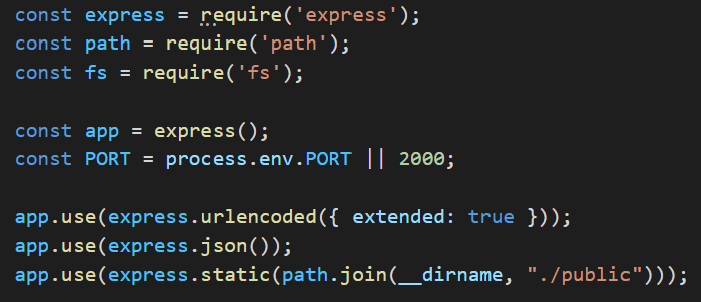
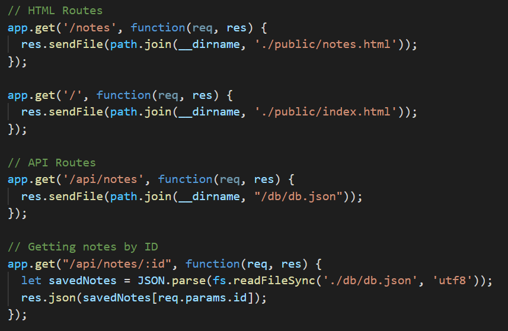
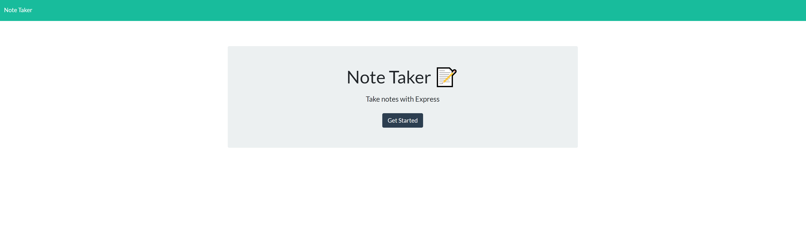
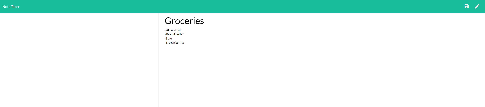
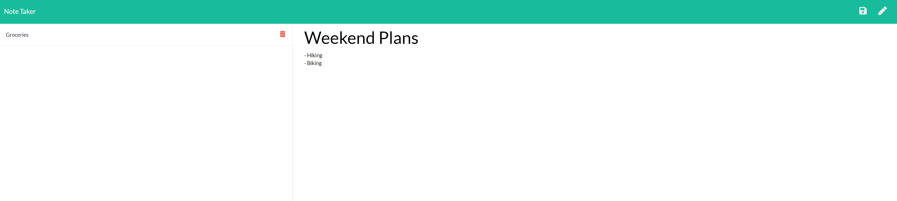

# Note Taking
An application to write, save, and delete notes using express.

## Description
This is a note taking application which utilizes express in order to link files, alter them, and then send them to a local host server. On the app itself the user can add notes to the page and also delete them. In order to save a note, both the note title and description must be filled. You can view notes and their information by clicking on them. From there, in order to add a new note you can use the pencil icon in the top right to create a new note to add.

## Table of Contents
* [Getting Started](#getting-started)
* [Installation](#installation)
* [Usage](#usage)
* [Author](#author)
* [Acknowledgments](#acknowledgments)
* [License](#license)

## Getting Started
* [Github Repository](https://github.com/nathanmvu/note-taking)
* [Deployed Link](https://aqueous-plains-52033.herokuapp.com/)
* [Usage Demo Video](https://drive.google.com/file/d/1ehFTvPjjX2obDWWZwYybmLrAHNESz3RM/view)

## Installation
It is recommended to access the application via the deployed link on Heroku however if you wish to access the program and run it yourself via localhost then here are the instructions.
This project uses Node.js so it will need to be installed in order to operate the application.
To install the project, download it from the Github repository. Running the program will require running:
```javascript
npm install
```
which will install some necessary packages such as Express. Afterwards, in the integrated terminal for the server.js file run:
```javascript
node server.js
```
and the application should open a port for the localhost which can be accessed via: https://localhost/2000

## Usage
Code Snippets:
* Application packages


* Express routes for HTML and API


Final Product:
* Initial Page


* Note 1:



* Note 2:


## Author
* Nathan Vu
* [Github](https://github.com/nathanmvu)
* [Email](mailto:nathanvu99@gmail.com)

## Acknowledgments
* Project parameters provided by the UCB Extension Coding Bootcamp

## License
[](https://github.com/tterb/atomic-design-ui/blob/master/LICENSEs)